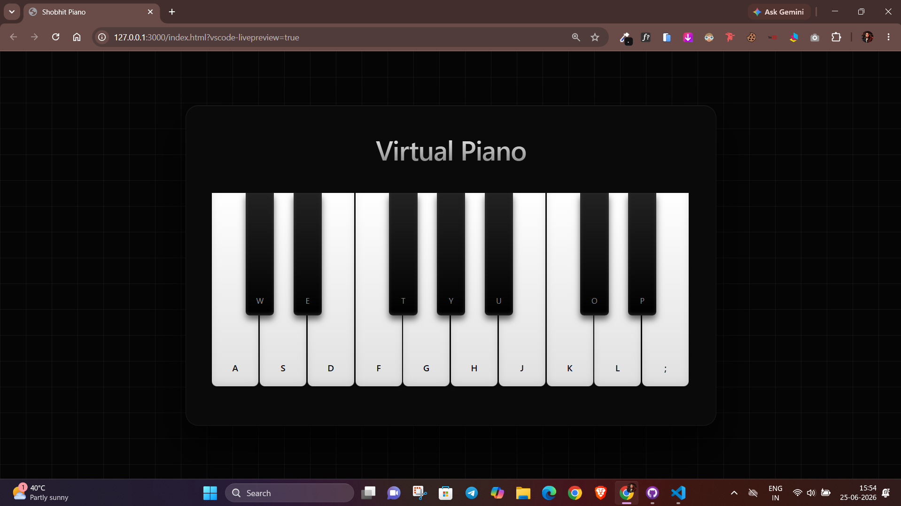

# 🎹 Virtual Piano

A simple and responsive **Virtual Piano** built using **HTML, CSS, and JavaScript**.

This project lets you play piano notes using both **mouse clicks** and your **computer keyboard**. Every key plays its own `.wav` sound, making the experience smooth and interactive.

## 🌐 Live Demo

👉 **Live Website:**
https://shobhit-piano.vercel.app/

## 📸 Preview

> Save your project screenshot as **output.png** inside the project folder.

```md

```

---

## ✨ Features

* Responsive piano layout
* Modern and clean UI
* Mouse click support
* Keyboard support
* Real piano sound effects
* Smooth key interaction
* Beginner-friendly code

---

## 🎹 Keyboard Controls

| White Keys | Black Keys |
| ---------- | ---------- |
| A          | W          |
| S          | E          |
| D          | -          |
| F          | T          |
| G          | Y          |
| H          | U          |
| J          | -          |
| K          | O          |
| L          | P          |
| ;          | -          |

---

## 🛠️ Built With

* HTML5
* CSS3
* JavaScript

---

## 📂 Project Structure

```text
online-piano/
│
├── index.html
├── style.css
├── script.js
├── README.md
├── output.png
│
└── tunes/
    ├── a.wav
    ├── d.wav
    ├── e.wav
    ├── f.wav
    ├── g.wav
    ├── h.wav
    ├── j.wav
    ├── k.wav
    ├── l.wav
    ├── o.wav
    ├── p.wav
    ├── s.wav
    ├── t.wav
    ├── u.wav
    ├── w.wav
    ├── y.wav
    └── ;.wav
```

---

## 🚀 Getting Started

### Clone the Repository

```bash
git clone https://github.com/shobhitasthana1/online-piano.git
```

### Go to the Project Folder

```bash
cd online-piano
```

### Run the Project

Simply open **index.html** in your browser or use **Live Server** in VS Code.

---

## 🔗 Project Links

**GitHub Profile**
https://github.com/shobhitasthana1

**Repository**
https://github.com/shobhitasthana1/online-piano

**Live Demo**
https://shobhit-piano.vercel.app/

---

## 💡 Future Improvements

* Volume control
* Record and playback
* More piano octaves
* Better animations
* Mobile gesture support
* Dark / Light mode

---

## 👨‍💻 Author

**Shobhit Asthana**

GitHub: https://github.com/shobhitasthana1

---

If you found this project helpful, please consider giving it a ⭐ on GitHub.
